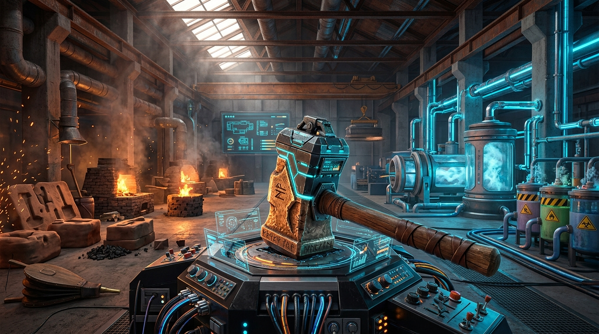

# MekaTFC

## 模组概述

群峦传说（TerraFirmaCraft）以其真实拟真的地质构造、原始硬核的生存机制与富有仪式感的冶金锻造体系著称；通用机械（Mekanism）则是现代科技向模组中的工业巨擘，凭借精密的气体流体反应、阶梯式矿物倍化与高度自动化的数字网络深受玩家喜爱。

在 TFC 生态中，两者的理念差异往往带来难以弥合的技术断层——TFC 移除了原版红石等基础资源，重构了地壳岩层与金属加工逻辑，使得常规工业科技难以自然生根。MekaTFC 正是为打破这一壁垒而生的专属兼容模组。它不是简单粗暴地打通物品 ID，而是将通用机械的原料脉络、机械结构与升级链条，深度缝合进 TFC 的拟真世界规则之中，让玩家能够从石器时代的蛮荒中一步步亲手打造出尖端数字工业。

## 现已实现的核心内容

### 地质融合：原生锇矿与勘探体系
在 MekaTFC 中，通用机械的核心基石——锇（Osmium），完全遵循群峦传说的地质学分布规律。模组为 TFC 全部 21 种原生岩石类型（如花岗岩、闪长岩、辉长岩、玄武岩、页岩等）量身定制了共计 63 种不同品级的原生锇矿石方块，涵盖贫瘠、普通与富集三种品位。

矿床以聚集矿脉的形式隐匿于地下深处，地表则散落着细小的原生锇碎矿作为找矿线索。玩家手持探矿镐勘探时，能够准确侦测到周围岩层中的原生锇矿脉，体验从勘探、开采到运输的原汁原味群峦采矿流程。所有矿石均配置了细致的半透明与镂空贴图混合渲染，自然融入周边岩体。

### 锻造与铸造：沉浸式的锇金属冶金
采集到的原生锇矿无法直接丢入普通熔炉烧制，而是需要纳入 TFC 的冶金温标与熔铸系统。当加热至 1500°C 熔点后，锇矿石将化为清澈浅青蓝色的熔融锇流体。

玩家可以使用耐火黏土锭模具承接熔融锇浇筑成锭，也可以在 TFC 铁砧上通过高温锤打与助焊剂，将两枚锇锭三级焊接为高强度的锇双锭。从原料提炼到金属塑形，每一步都浸润着汗水与铁锤的敲击声。

### 科技启蒙：红石混合物与第一台机壳
原版红石的缺失是迈向工业时代最大的阻碍。MekaTFC 引入了符合地质化学逻辑的早期获取方案：将硫磺粉、铜粉与铁粉精细配比制成红石混合物，再投入装满清水的密封木桶中浸泡反应，即可沉淀提纯出科技时代不可或缺的红石粉。

在此基础之上，玩家需在三级 TFC 铁砧上，将炽热的熟铁板与锇双锭熔接一体，亲手敲打铸造出通用机械的核心构件——钢质机壳（Steel Casing）。通过这套富有仪式感的过渡工艺，工业文明的第一声轰鸣在铁砧与锻炉之上正式拉开序幕。

### 工厂回响：全阶梯矿物倍化对接
当第一台工业机器组装完毕，TFC 的各类原生锇矿及地表小矿石可无缝投入通用机械的分级加工链条中。从基础的粉碎机、富集仓，到二级的净化仓，乃至高阶的化学注入室与化学溶解室，每一级处理都精准适配了 TFC 矿石的品位与产出比例。红石混合物同样接入了化学注入路线，允许在拥有工业气体后以更高的转化效率批量萃取红石。

### 难度分级：可定制的配方模式
考虑到不同玩家与整合包作者的平衡需求，MekaTFC 内置了配方难度配置系统：
简单模式（EASY）保留了快捷简化的工作台通道，适合偏向轻度体验的玩家；普通模式（NORMAL）则关闭捷径，强制要求玩家深度依赖 TFC 锻造与木桶反应来跨入科技门槛；同时还为极限挑战预留了硬核模式（HARDCORE）的扩展接口。

## 规划中与未来制作方向

后续版本将持续拓宽科技与拟真生存的交汇边界，重点规划以下内容：

群峦金属与合金的全面工业化：将 TFC 独有的青铜系（黑青铜、锻青铜、铋青铜）以及高阶合金（黑钢、红钢、蓝钢等）全面接入通用机械的合金灌注、管道升级与特种机械构件制造中。

能源与动力体系互通：打通 TFC 风车/水车机械动能与焦耳/FE 能量的初级转换，调整焦炭、无烟煤等 TFC 特有燃料在通用机械发电机与燃气轮机中的燃烧效能。

化学化工与生态农业循环：利用 TFC 的盐水、矿泉水、石灰水等特有流体，与通用机械的热力蒸馏塔、电解分离机联动，制取工业级酸液与副产物；将 TFC 农作物与植物油脂深度整合入生物燃料制造链。

高阶工业装备的群峦锻造强化：探索在 TFC 铁砧上对原子分解刃、机甲部件（Meka-Suit）进行强化锻造、淬火与维护保养的机制。

图鉴与生态引导集成：适配 EMI、JEI 等配方检索界面的自定义流程展示，并提供专属的游戏内指南文档。
